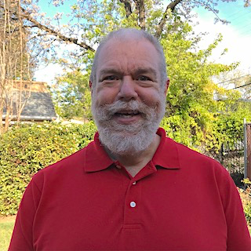

I have a real passion for helping people live better, more pain-free lives through massage therapy and bodywork.

## Service to others is the highest form of living

Throughout my life, I have sought to be of service to other people.  From the boy scouts, United States Navy, serving on the Boards of Directors of multiple non-profit organizations, service is something I have done.  It's my deepest value.

For the past 20+ years, my work has been about relieving pain, removing stress, setting you free.  Through that service, and my relentless drive to understand everything about the human myofascial system, I have taken myofascial release into its next phase.  

That innovation is for you.

You don't have to hurt - Zero Point AMFR can help!  

[Book a massage today!](https://paulbrown.noterro.com)
